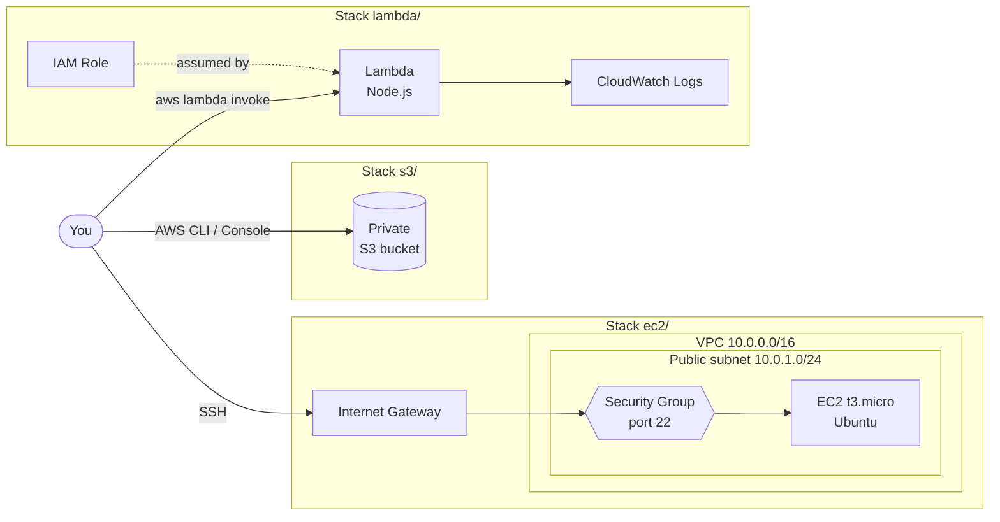

# learn-terraform-with-aws

A study project for Infrastructure as Code (IaC) with [Terraform](https://developer.hashicorp.com/terraform) on AWS.

Each service lives in its own **independent stack**: a folder with its own configuration and its own state. This way you can deploy, test and destroy one service at a time without touching the others.

## Services

| | Service | Stack | What gets created |
|:-:|---|---|---|
|  | Amazon EC2 | [`ec2/`](ec2) | `t3.micro` instance (Ubuntu) reachable over SSH |
|  | Amazon VPC | [`ec2/`](ec2) | VPC, public subnet, Internet Gateway, route table and security group |
|  | Amazon S3 | [`s3/`](s3) | Private bucket with all public access blocked |
|  | AWS Lambda | [`lambda/`](lambda) | Node.js function that returns a "Hello" message |
|  | AWS IAM | [`lambda/`](lambda) | Lambda execution role |
|  | Amazon CloudWatch | [`lambda/`](lambda) | Lambda log group with 14-day retention |

## Diagram



## Structure

```
.
├── ec2/            # networking (VPC, subnet, IGW, SG) + EC2 instance
│   ├── network.tf
│   ├── security.tf
│   ├── compute.tf
│   └── ...
├── s3/             # private S3 bucket
│   └── main.tf
├── lambda/         # Lambda function + IAM + CloudWatch
│   ├── src/index.mjs
│   ├── iam.tf
│   └── main.tf
└── docs/icons/     # icons used in this README
```

Every stack follows the same file layout:

| File | Contents |
|---|---|
| `terraform.tf` | Required providers and their versions |
| `providers.tf` | AWS provider configuration (region) |
| `variables.tf` | Input variables, all with default values |
| `outputs.tf` | Values printed after `apply` |
| other `.tf` files | Resources, split by concern |

## Running it on your machine

### 1. Prerequisites

- [Terraform](https://developer.hashicorp.com/terraform/install) 1.x
- [AWS CLI](https://docs.aws.amazon.com/cli/latest/userguide/getting-started-install.html) v2
- An AWS account and an IAM user with permission to create the resources above
- For the `ec2/` stack: an SSH key pair (`ssh-keygen -t ed25519`)

### 2. Clone the repository

```bash
git clone https://github.com/lubjr/learn-terraform-with-aws.git
cd learn-terraform-with-aws
```

### 3. Configure your AWS credentials

Terraform uses the same credentials as the AWS CLI. Pick **one** of the options below.

**Option A: `aws configure` (recommended)**

```bash
aws configure
# AWS Access Key ID:     <your access key>
# AWS Secret Access Key: <your secret key>
# Default region name:   us-east-1
# Default output format: json
```

If you use more than one profile, select it before running Terraform:

```bash
export AWS_PROFILE=my-profile
```

**Option B: environment variables**

```bash
export AWS_ACCESS_KEY_ID="<your access key>"
export AWS_SECRET_ACCESS_KEY="<your secret key>"
export AWS_REGION="us-east-1"
```

Check that your credentials work:

```bash
aws sts get-caller-identity
```

> Never put credentials in `.tf` files or commit them. The `.gitignore` already ignores `*.tfvars` and `*.tfstate` files.

### 4. Adjust the variables (optional)

Every variable has a default value, but you can override any of them by creating a `terraform.tfvars` file inside the stack. Example for `ec2/`:

```hcl
# ec2/terraform.tfvars
ssh_allowed_cidrs = ["203.0.113.10/32"] # your public IP (see https://checkip.amazonaws.com)
public_key_path   = "~/.ssh/id_ed25519.pub"
```

Main variables per stack:

| Stack | Variable | Default | Description |
|---|---|---|---|
| all | `aws_region` | `us-east-1` | Region where resources are created |
| `ec2/` | `ssh_allowed_cidrs` | `["0.0.0.0/0"]` | IPs allowed to connect over SSH |
| `ec2/` | `public_key_path` | `~/.ssh/id_ed25519.pub` | SSH public key uploaded to AWS |
| `ec2/` | `instance_type` | `t3.micro` | Instance type |
| `ec2/` | `ami_id` | `ami-0b6d9d3d33ba97d99` | Ubuntu 26.04, **only valid in `us-east-1`** |
| `s3/` | `bucket_prefix` | `learn-terraform-` | Bucket name prefix |
| `lambda/` | `function_name` | `learn-terraform-hello` | Function name |
| `lambda/` | `runtime` | `nodejs24.x` | Function runtime |

If you change `aws_region` in the `ec2/` stack, also change `ami_id` and `availability_zone`, since an AMI ID is only valid in its own region.

### 5. Deploy a stack

Go into the service folder and run:

```bash
cd s3            # or ec2, or lambda
terraform init   # downloads the providers (first time only)
terraform plan   # shows what will be created
terraform apply  # creates the resources (confirm with "yes")
```

### 6. Test it

**EC2:** connect over SSH using the IP from the output:

```bash
cd ec2
ssh -i ~/.ssh/id_ed25519 ubuntu@$(terraform output -raw public_ip)
```

**S3:** upload a file to the bucket:

```bash
cd s3
echo "hello" > test.txt
aws s3 cp test.txt s3://$(terraform output -raw bucket_name)/
aws s3 ls s3://$(terraform output -raw bucket_name)/
```

**Lambda:** invoke the function:

```bash
cd lambda
aws lambda invoke \
  --function-name $(terraform output -raw function_name) \
  --cli-binary-format raw-in-base64-out \
  --payload '{"name":"Terraform"}' \
  out.json && cat out.json
```

### 7. Destroy

To avoid costs, destroy the resources when you are done:

```bash
terraform destroy
```

If the S3 bucket contains files, `destroy` will fail. Empty the bucket first:

```bash
aws s3 rm s3://$(terraform output -raw bucket_name) --recursive
```

## Costs

The resources were chosen to stay within or close to the [Free Tier](https://aws.amazon.com/free/), but that depends on your account. The EC2 instance is the resource most likely to incur charges if left running. **Always run `terraform destroy` when you are done.**

## Notes

- Terraform state is stored **locally** (`terraform.tfstate` in each folder). If you delete that file, Terraform loses track of the resources it created and they must be removed manually from the console.
- By default SSH is open to any IP (`0.0.0.0/0`). For anything beyond a quick test, restrict `ssh_allowed_cidrs` to your own IP.
- The icons in `docs/icons/` are the official [AWS Architecture Icons](https://aws.amazon.com/architecture/icons/).
