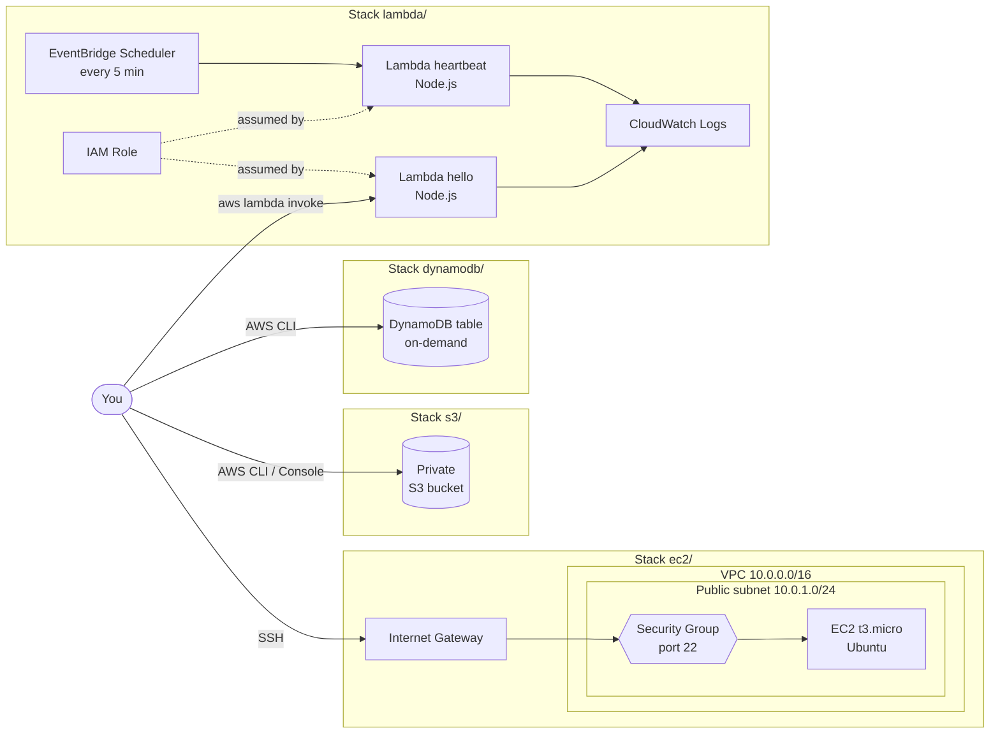

# learn-terraform-with-aws

A study project for Infrastructure as Code (IaC) with [Terraform](https://developer.hashicorp.com/terraform) on AWS.

Each service lives in its own **independent stack**: a folder with its own configuration and its own state. This way you can deploy, test and destroy one service at a time without touching the others.

## Services

| | Service | Stack | What gets created |
|:-:|---|---|---|
|  | Amazon EC2 | [`ec2/`](docs/stacks/ec2.md) | `t3.micro` instance (Ubuntu) reachable over SSH |
|  | Amazon VPC | [`ec2/`](docs/stacks/ec2.md) | VPC, public subnet, Internet Gateway, route table and security group |
|  | Amazon S3 | [`s3/`](docs/stacks/s3.md) | Private bucket with all public access blocked |
|  | AWS Lambda | [`lambda/`](docs/stacks/lambda.md) | Node.js functions: `hello` (on demand) and `heartbeat` (scheduled) |
|  | AWS IAM | [`lambda/`](docs/stacks/lambda.md) | Lambda execution role and scheduler role |
|  | Amazon CloudWatch | [`lambda/`](docs/stacks/lambda.md) | One log group per function with 14-day retention |
|  | Amazon EventBridge Scheduler | [`lambda/`](docs/stacks/lambda.md) | Runs `heartbeat` every 5 minutes |
|  | Amazon DynamoDB | [`dynamodb/`](docs/stacks/dynamodb.md) | On-demand table with `pk`/`sk` keys and TTL |

## Diagram



## Quick start

With [Terraform](https://developer.hashicorp.com/terraform/install) and the [AWS CLI](https://docs.aws.amazon.com/cli/latest/userguide/getting-started-install.html) installed and your AWS credentials configured:

```bash
git clone https://github.com/lubjr/learn-terraform-with-aws.git
cd learn-terraform-with-aws/s3   # or ec2, lambda, dynamodb
terraform init
terraform apply
terraform destroy                # when you are done
```

See [Getting started](docs/getting-started.md) for the full setup.

## Documentation

| Page | Contents |
|---|---|
| [Getting started](docs/getting-started.md) | Prerequisites, AWS credentials, variables and deploy workflow |
| [Project structure](docs/project-structure.md) | Folder layout and the file convention shared by every stack |
| [EC2 stack](docs/stacks/ec2.md) | VPC networking and an SSH-reachable instance |
| [S3 stack](docs/stacks/s3.md) | Private S3 bucket |
| [Lambda stack](docs/stacks/lambda.md) | Node.js functions with IAM roles, CloudWatch logs and a schedule |
| [DynamoDB stack](docs/stacks/dynamodb.md) | On-demand table with composite key and TTL |
| [Costs and cleanup](docs/costs-and-cleanup.md) | Free Tier notes, destroying resources and local state caveats |
