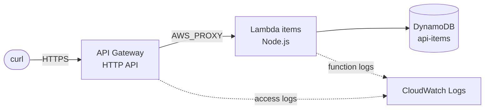

# API Gateway stack

[Back to README](../../README.md)

  

Source: [`api/`](../../api)

Creates a public HTTP API with CRUD routes for `items`. API Gateway forwards every request to a single Node.js Lambda function, which reads and writes a DynamoDB table.

## Request flow



## Routes

| Route | Success | Description |
|---|---|---|
| `GET /items` | `200` | Lists every item (table scan) |
| `POST /items` | `201` | Creates an item from the JSON body, with a generated `id` and `createdAt` |
| `GET /items/{id}` | `200` | Returns one item, or `404` |
| `PUT /items/{id}` | `200` | Replaces an existing item with the JSON body and sets `updatedAt`, or `404` |
| `DELETE /items/{id}` | `204` | Deletes an existing item, or `404` |

A body that is not a JSON object returns `400`.

Every route points to the same integration. The handler in [`src/items/index.mjs`](../../api/src/items/index.mjs) picks the code to run from `event.routeKey` (for example `GET /items/{id}`), which the HTTP API sends with payload format `2.0`. The handler uses the AWS SDK for JavaScript v3 that ships with the Node.js runtime, so there is no `node_modules` to package.

## Resources

| File | Resource | Description |
|---|---|---|
| `api.tf` | `aws_apigatewayv2_api.main` | HTTP API named `<name_prefix>-api` |
| `api.tf` | `aws_apigatewayv2_integration.items` | Lambda proxy integration, payload format `2.0` |
| `api.tf` | `aws_apigatewayv2_route.items[*]` | One route per entry in `local.routes` |
| `api.tf` | `aws_apigatewayv2_stage.default` | `$default` stage with auto deploy, throttling and access logs |
| `api.tf` | `aws_cloudwatch_log_group.access` | `/aws/apigateway/<name_prefix>-api` for the access logs |
| `api.tf` | `aws_lambda_permission.api` | Allows this API, and only this API, to invoke the function |
| `main.tf` | `data.archive_file.items` | Zips `src/items/` into `build/items.zip` |
| `main.tf` | `aws_lambda_function.items` | Function `<name_prefix>-api-items`, gets the table name in `TABLE_NAME` |
| `main.tf` | `aws_cloudwatch_log_group.function` | `/aws/lambda/<name_prefix>-api-items` with limited retention |
| `dynamodb.tf` | `aws_dynamodb_table.items` | On-demand table `<name_prefix>-api-items` keyed by `id` |
| `iam.tf` | `aws_iam_role.lambda` | Execution role assumed by the function |
| `iam.tf` | `aws_iam_role_policy_attachment.basic_execution` | Lets the function write its logs |
| `iam.tf` | `aws_iam_role_policy.table_access` | `GetItem`, `PutItem`, `DeleteItem` and `Scan` on this table only |

There are two kinds of permission here. The execution role is an **identity-based** policy: it says what the function can do (write to the table). The Lambda permission is a **resource-based** policy on the function: it says who can invoke it (API Gateway, limited by `source_arn` to this API). The `lambda/` stack does the opposite for the scheduler, which assumes its own role to invoke the function.

The `$default` stage has no path prefix, so the routes are served directly under `api_url`. With `auto_deploy`, every change to the routes is published without a separate deployment resource.

## Variables

| Variable | Default | Description |
|---|---|---|
| `aws_region` | `us-east-1` | Region where resources are created |
| `name_prefix` | `learn-terraform` | Prefix for the API, function, table and role names |
| `runtime` | `nodejs24.x` | Lambda runtime |
| `log_retention_days` | `14` | Days to keep the function and access logs |
| `throttling_rate_limit` | `5` | Steady-state requests per second on every route |
| `throttling_burst_limit` | `10` | Maximum concurrent requests on every route |

## Outputs

| Output | Description |
|---|---|
| `api_url` | Base URL of the API |
| `function_name` | Name of the Lambda function |
| `table_name` | Name of the DynamoDB table |

## Testing

Create an item and keep its `id`:

```bash
cd api
URL=$(terraform output -raw api_url)

ID=$(curl -s -X POST "$URL/items" \
  -H "content-type: application/json" \
  -d '{"name":"notebook","price":12.5}' | jq -r '.id')
```

Read, list, update and delete it:

```bash
curl -s "$URL/items/$ID"
curl -s "$URL/items"

curl -s -X PUT "$URL/items/$ID" \
  -H "content-type: application/json" \
  -d '{"name":"notebook","price":10}'

curl -s -i -X DELETE "$URL/items/$ID"   # HTTP/2 204
curl -s -i "$URL/items/$ID"             # HTTP/2 404
```

Check the access logs and the function logs:

```bash
aws logs tail "/aws/apigateway/learn-terraform-api" --since 10m
aws logs tail "/aws/lambda/$(terraform output -raw function_name)" --since 10m
```

## Notes

- The API is public and has no authentication. Throttling limits how many requests it accepts, but anyone with the URL can call it. Run `terraform destroy` when you are done.
- `GET /items` uses `Scan`, which reads the whole table. That is fine for a few items, but a real API would use `Query` with a key design like the one in the [DynamoDB stack](dynamodb.md).
- The function, table and role names are fixed, so deploying this stack twice in the same account and region will fail with a name conflict. They do not conflict with the `lambda/` and `dynamodb/` stacks.
- The Free Tier includes 1 million HTTP API calls a month for the first 12 months. Lambda and the on-demand table cost nothing while idle.
