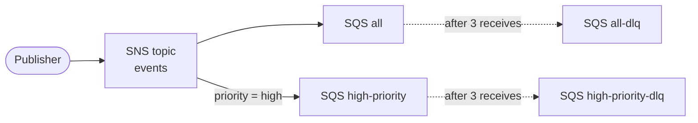

# SNS + SQS stack

[Back to README](../../README.md)

 

Source: [`sns-sqs/`](../../sns-sqs)

Creates an SNS topic that fans out every published message to several SQS queues. Each queue has its own dead-letter queue and can use a filter policy to receive only some of the messages.

## Fan-out



Every entry in the `queues` variable gets its own queue, dead-letter queue and subscription through `for_each`. With the defaults:

| Queue | Filter policy | Receives |
|---|---|---|
| `all` | none | Every message published to the topic |
| `high-priority` | `{ "priority": ["high"] }` | Only messages with the message attribute `priority = high` |

To add a queue, add an entry to `queues`. Set `filter_policy` to filter on message attributes.

## Resources

| File | Resource | Description |
|---|---|---|
| `sns.tf` | `aws_sns_topic.main` | Topic named `<name_prefix>-events` |
| `sns.tf` | `aws_sns_topic_subscription.queue[*]` | Subscribes each queue to the topic, with its optional filter policy |
| `sqs.tf` | `aws_sqs_queue.main[*]` | One queue per entry, named `<name_prefix>-<name>` |
| `sqs.tf` | `aws_sqs_queue.dlq[*]` | Dead-letter queue for each queue, keeps messages for 14 days |
| `sqs.tf` | `aws_sqs_queue_redrive_allow_policy.dlq[*]` | Lets only its own source queue use each dead-letter queue |
| `sqs.tf` | `aws_sqs_queue_policy.allow_sns[*]` | Allows the topic, and only this topic, to send messages to the queue |

SNS does not use an IAM role to deliver to SQS. The queue policy grants `sqs:SendMessage` to the `sns.amazonaws.com` service, and the `aws:SourceArn` condition limits it to this topic. The subscription depends on the queue policy so that no message is dropped while the policy is still being created.

A message that is received `max_receive_count` times without being deleted is moved to the dead-letter queue. This keeps a message that always fails from blocking consumers forever.

Subscriptions use raw message delivery by default, so the queue receives the published body as is. Without it, SNS wraps the body in a JSON envelope with the topic ARN, message ID and attributes.

Queues use SQS managed server-side encryption (SSE-SQS), which is the default. SSE-KMS with the AWS managed `aws/sqs` key would block delivery, because SNS cannot use that key.

## Variables

| Variable | Default | Description |
|---|---|---|
| `aws_region` | `us-east-1` | Region where resources are created |
| `name_prefix` | `learn-terraform` | Prefix for the topic and queue names |
| `queues` | `all`, `high-priority` | Map of queues, with optional `filter_policy` and `raw_message_delivery` (default `true`) |
| `visibility_timeout_seconds` | `30` | Time a received message stays hidden from other consumers |
| `max_receive_count` | `3` | Receives before a message moves to the dead-letter queue |

## Outputs

| Output | Description |
|---|---|
| `topic_arn` | ARN of the topic |
| `queue_urls` | URL of each queue, keyed by queue |
| `dlq_urls` | URL of each dead-letter queue, keyed by queue |

## Testing

Publish one message without attributes and one with `priority = high`:

```bash
cd sns-sqs
TOPIC=$(terraform output -raw topic_arn)

aws sns publish --topic-arn "$TOPIC" --message "regular message"

aws sns publish --topic-arn "$TOPIC" --message "urgent message" \
  --message-attributes '{"priority":{"DataType":"String","StringValue":"high"}}'
```

Read both queues. `all` gets the two messages and `high-priority` gets only the urgent one:

```bash
ALL=$(terraform output -json queue_urls | jq -r '.all')
HIGH=$(terraform output -json queue_urls | jq -r '."high-priority"')

aws sqs receive-message --queue-url "$ALL" --max-number-of-messages 10 --wait-time-seconds 5
aws sqs receive-message --queue-url "$HIGH" --max-number-of-messages 10 --wait-time-seconds 5
```

Receiving a message does not remove it. Delete it with the `ReceiptHandle` from the response:

```bash
aws sqs delete-message --queue-url "$ALL" --receipt-handle "<ReceiptHandle>"
```

To see the dead-letter queue in action, receive the same message in `high-priority` three times without deleting it, waiting more than 30 seconds between receives. On the next receive it is gone from the queue and shows up in `high-priority-dlq`:

```bash
aws sqs receive-message --queue-url "$(terraform output -json dlq_urls | jq -r '."high-priority"')"
```

## Notes

- Topic and queue names are fixed, so deploying this stack twice in the same account and region will fail with a name conflict.
- `terraform destroy` deletes the queues even if they contain messages.
- After a queue is deleted, AWS can take up to 60 seconds before a queue with the same name can be created again.
- SNS and SQS are free while idle. The Free Tier includes 1 million SNS publishes and 1 million SQS requests a month.
